# Attendance System / Flutter App
This is a flutterflow attendance demo project.
#

## Architecture of Project:

* MVVM
* Core Widget
* Base Models
* State Management with MobX, Provider
* Cache Management
* Navigation
* Network Layer
* Multi-language
* Theme Notifier

## How to Use 

First things first: you must properly set the following environment variable (/asset/app/.env):

- APP_API_SITE  (The backend service URL) 

**Attendance System Backend Service:**

**Step 1:**

Download or clone this repo

**Step 2:**

Go to project root and execute the following command in console to get the required dependencies: 

```
flutter pub get 
```
**Step 3:**

To run this project all we have to do is run this command

```
flutter run 
```

## Screenshots

<table>
  <tr>
     <td>Splash</td>
     <td>OnBoard</td>
     <td>Sign Up</td>
  </tr>
  <tr>
     <td>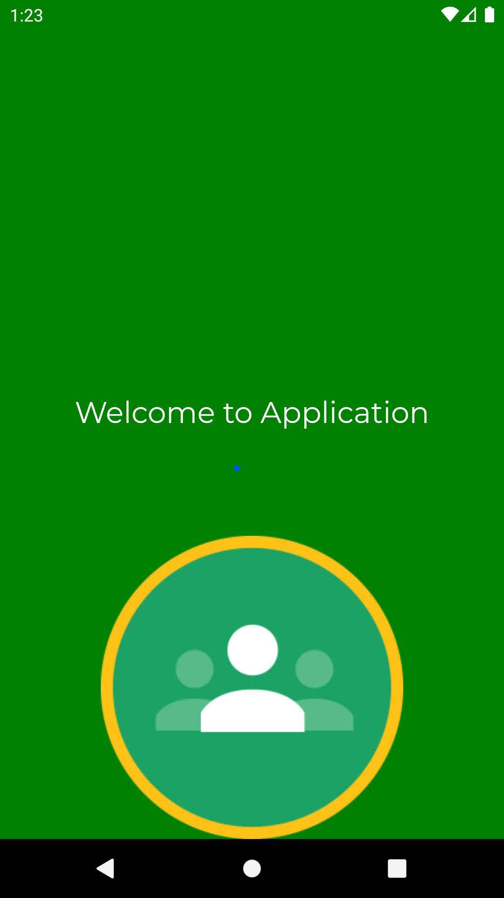</td>
     <td>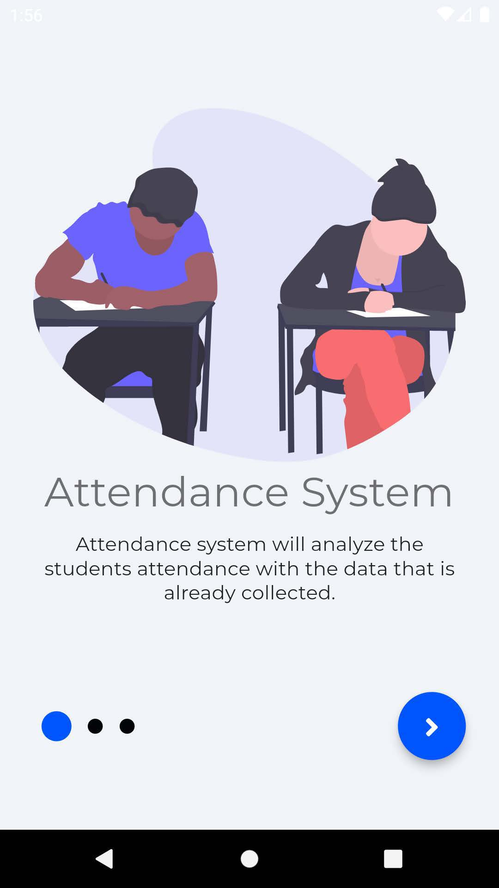</td>
     <td>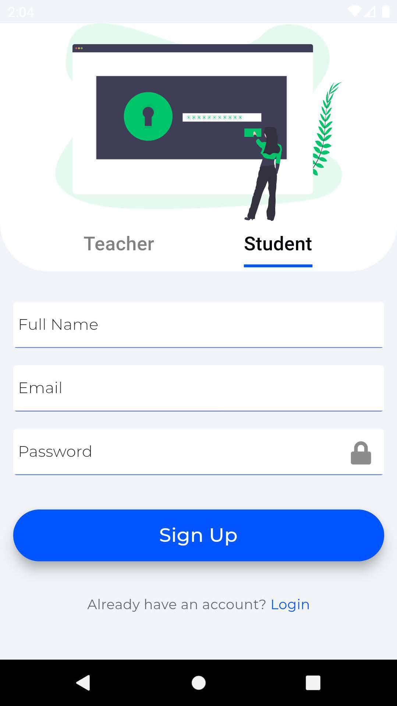</td>
  </tr>
 </table>

<table>
  <tr>
     <td>Sign In</td>
     <td>Forgot Password</td>
     <td>Confirm OTP</td>
  </tr>
  <tr>
     <td>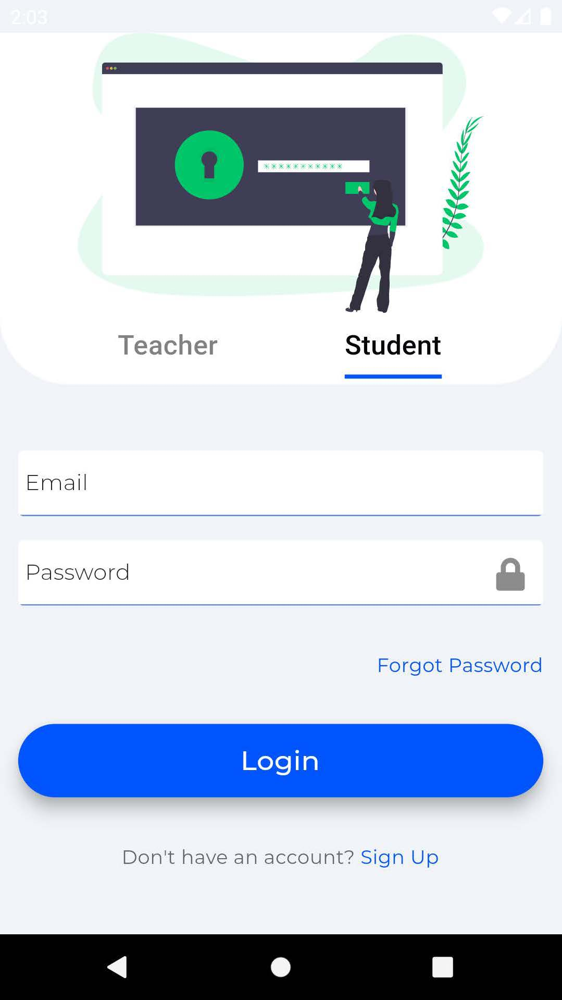</td>
     <td>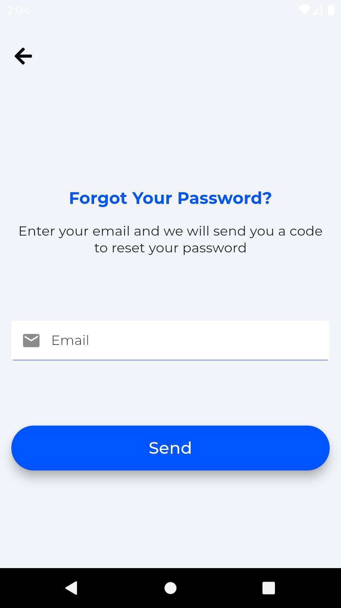</td>
     <td>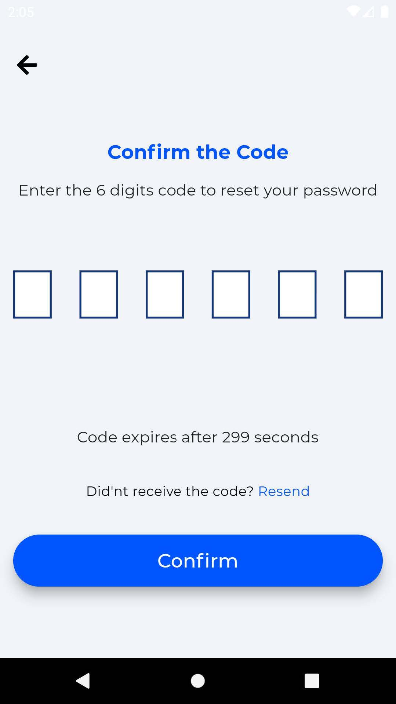</td>
  </tr>
 </table>
 <table>
  <tr>
     <td>Change Password</td>
     <td>Menu</td>
     <td>Course List</td>
  </tr>
  <tr>
     <td>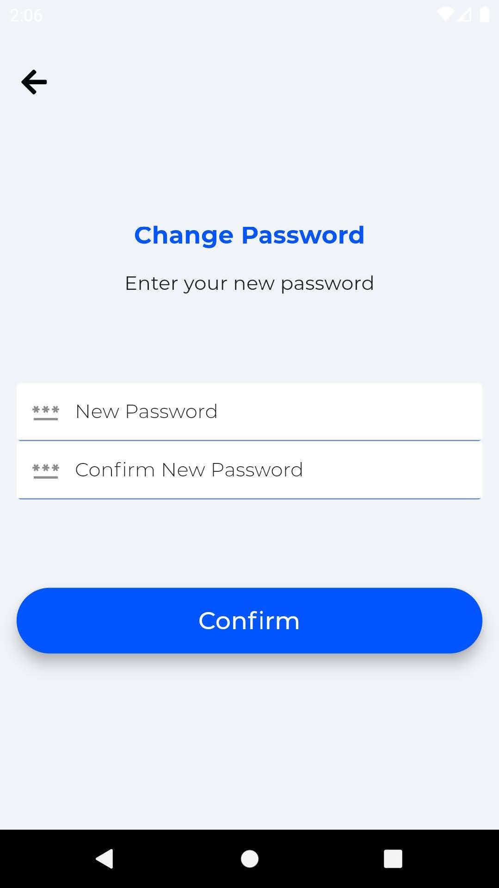</td>
     <td>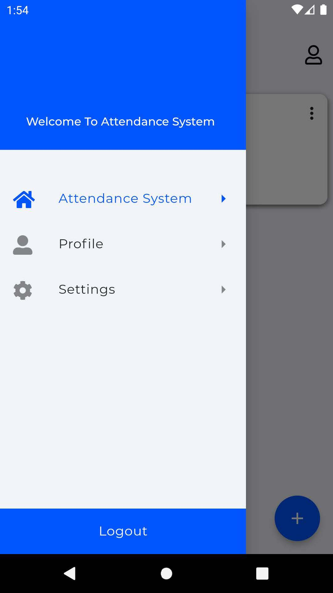</td>
     <td>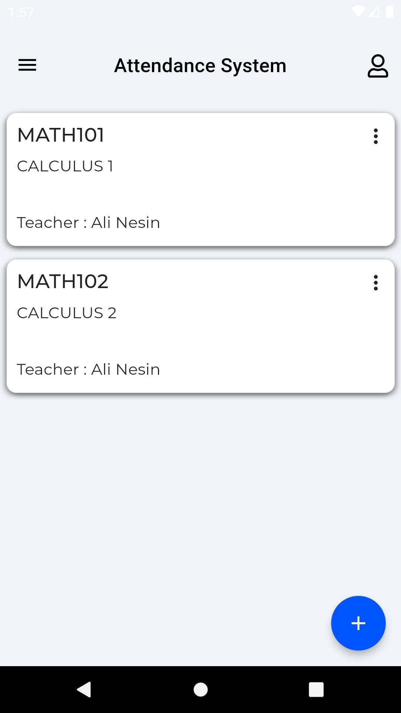</td>
  </tr>
 </table>
 <table>
  <tr>
     <td>Teacher Create Course</td>
     <td>Teacher Add Schedule</td>
     <td>Teacher Delete Course</td>
  </tr>
  <tr>
     <td>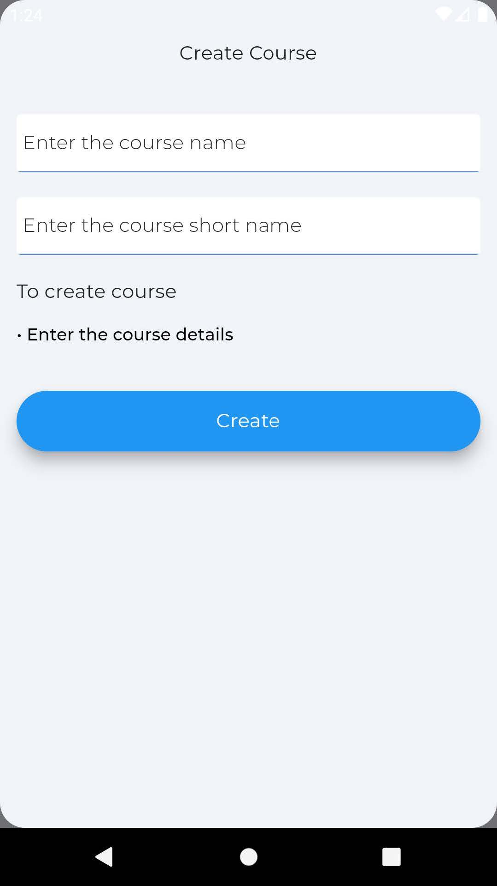</td>
     <td>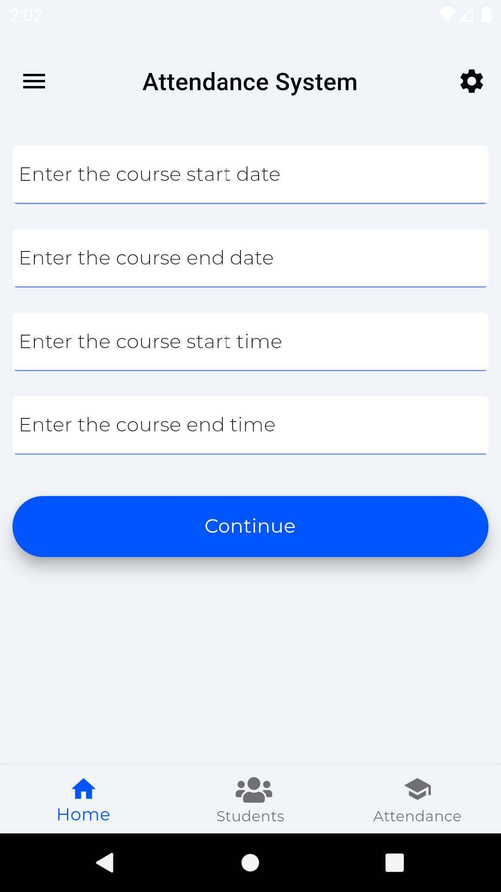</td>
     <td>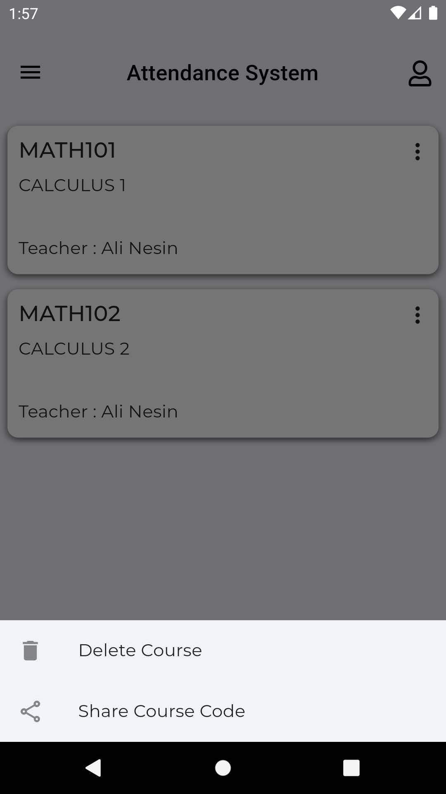</td>
  </tr>
 </table>
  <table>
  <tr>
     <td>Student Join Course</td>
     <td>Student Enroll</td>
     <td>Course Students</td>
  </tr>
  <tr>
     <td>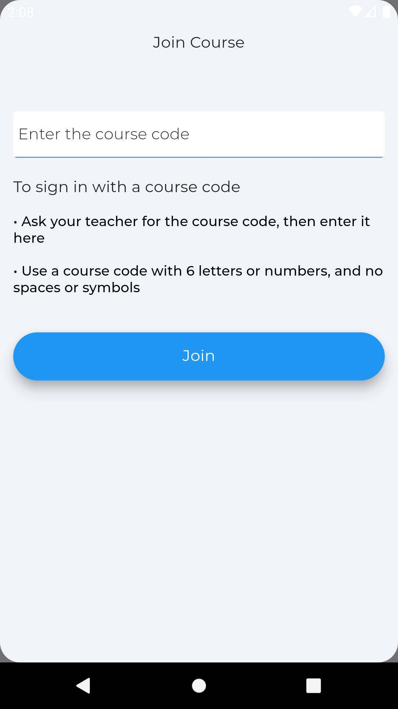</td>
     <td>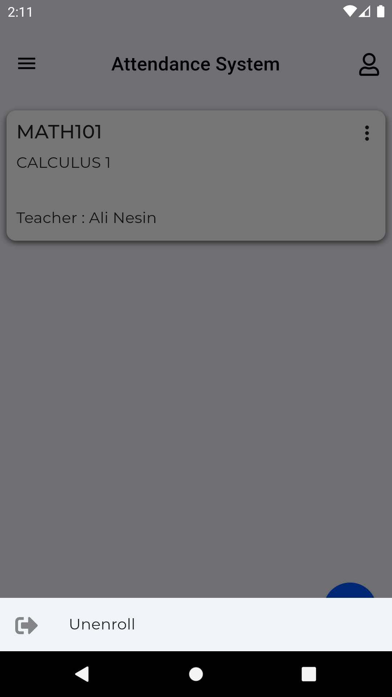</td>
     <td>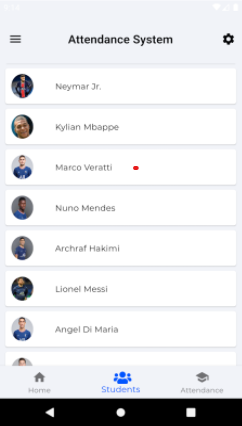</td>
  </tr>
 </table>
<table>
  <tr>
     <td>Course Lesson Dates</td>
     <td>Course Attendace</td>
     <td>Profile</td>
  </tr>
  <tr>
     <td>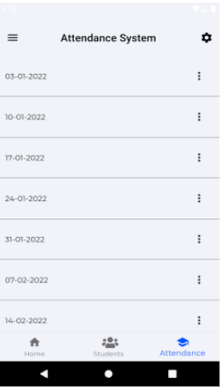</td>
     <td>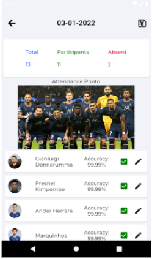</td>
     <td>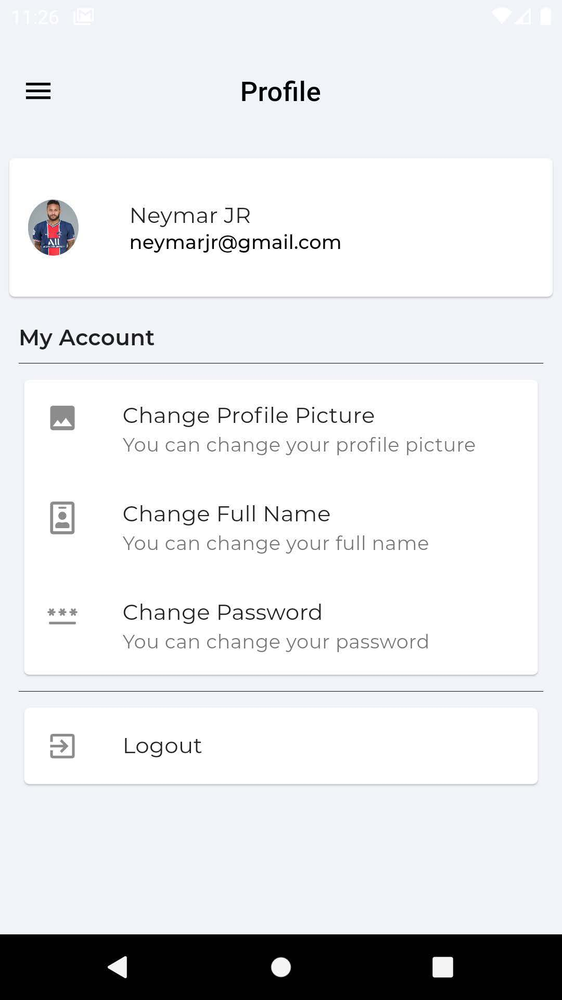</td>
  </tr>
 </table>
 <table>
  <tr>
     <td>Settings</td>
     <td>Dark Mode</td>
     <td>Multi Language</td>
  </tr>
  <tr>
     <td></td>
     <td>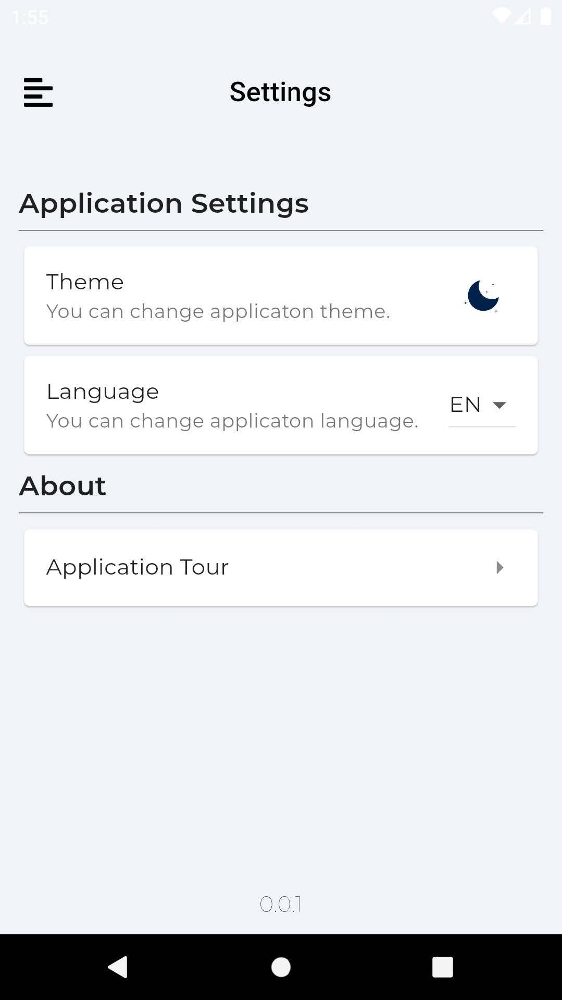</td>
     <td>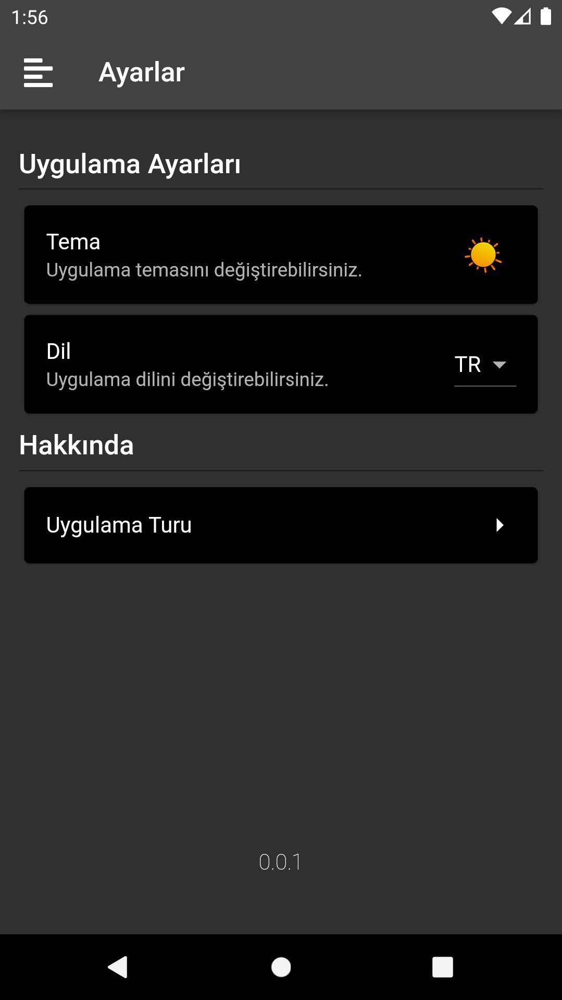</td>
  </tr>
 </table>
```


